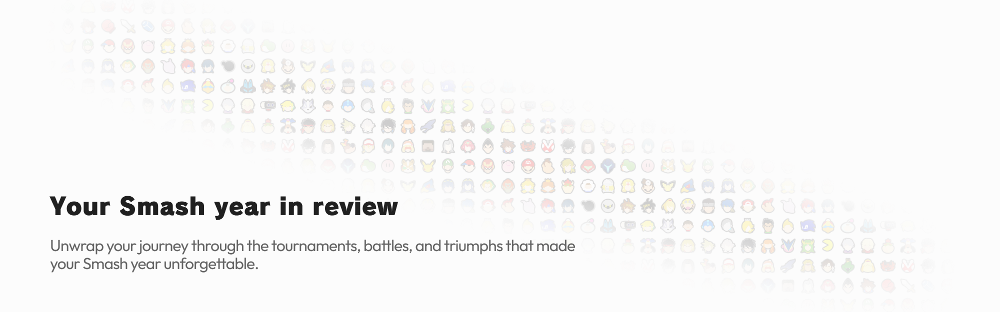

<a href="#">
	<picture>
		<source media="(prefers-color-scheme: dark)" srcset=".github/assets/banner_dark.png">
		
	</picture>
</a>

## Déploiement

L'application peut être déployée en utilisant Docker Compose. Pour ce faire, vous devez avoir Docker et Docker Compose installés sur votre système.

1. Clonez le dépôt
   ```
   git clone https://github.com/pnsgg/smashrecap.git
   ```
2. Déplacez-vous dans le répertoire du projet
   ```
   cd smash-recap
   ```
3. Créer le fichier .env à partir du fichier .env.example
   ```
   cp .env.example .env
   ```
4. Rendez-vous sur [start.gg](https://start.gg) => `Developer Settings` => `OAuth Applications` => `Create OAuth Client`
 - Remplissez les champs requis et créez l'application OAuth
 - Copiez le `client id`, `client secret` et l'`Application Authorization Callback` dans le fichier .env
4. Lancer les conteneurs docker
   ```
   docker-compose up -d --build
   ```
4. Visitez l'application à l'adresse http://localhost:3001
